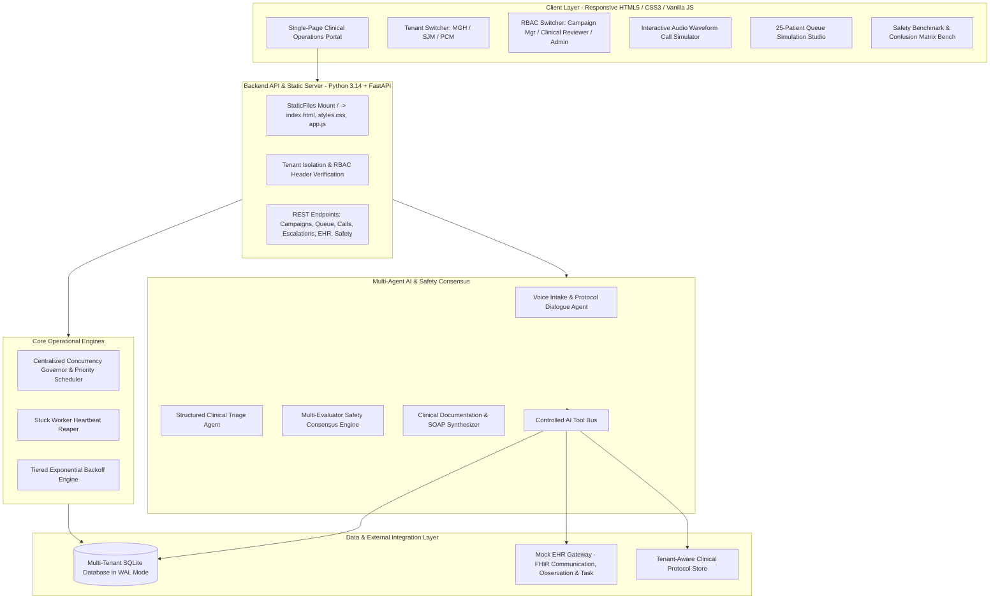

# Platform Architecture: Multi-Hospital Post-Discharge Outreach Platform

## 1. System Overview

The **Multi-Hospital Post-Discharge Outreach Platform** is a multi-tenant, queue-driven, observable AI healthcare system. It automates and coordinates post-discharge patient follow-up, clinical triage, consensus-based safety escalation, and EHR documentation across multiple hospital tenants.

---

## 2. Service Boundaries & Responsibilities

### 2.1 Frontend Operations Portal
- **Technology**: Pure HTML5, Modern CSS3 (Dark Slate clinical aesthetic), and Modular ES6+ JavaScript.
- **Serving**: Directly hosted by FastAPI via `StaticFiles`. Zero external node_modules or npm build step required.
- **Tenant & RBAC Control**: Instant multi-tenant switching (Metro General Hospital, St. Jude Memorial Health, Pacific Coast Medical) and role switching (Platform Admin, Hospital Admin, Campaign Manager, Clinical Reviewer).

### 2.2 API & Middleware Layer
- **Technology**: Python 3.14 + FastAPI + Pydantic v2.
- **Tenant Isolation**: Backend enforces tenant boundaries at the data-access layer. Every query mandates `X-Tenant-ID`. Hospital A cannot retrieve Hospital B's patient, encounter, or task data.
- **Audit Logging**: Every mutating action (campaign status toggle, call finish, human escalation resolution) writes an immutable record to `audit_logs`.

### 2.3 Outbound Queue Engine
- **Centralized Concurrency Governor**: Central atomic slot reservation against `hospitals.max_concurrent_calls` to prevent distributed worker race conditions.
- **Multi-Factor Priority Scheduler**: Combines clinical risk score, exponential deadline pressure, discharge age, campaign priority, and anti-starvation aging.
- **Dead-Man Heartbeat Reaper**: Detects orphaned tasks with stale worker heartbeats (>90s) and safely frees calling capacity.

### 2.4 Multi-Agent AI Safety System
- **Voice Intake Agent**: Protocol-guided conversational flow with empathy, clarification, and emergency detection.
- **Clinical Triage Agent**: Extracts structured indicators from transcripts, maps against protocol red-flags, and outputs validated `StructuredTriageOutput`.
- **Consensus Decision Engine**: Dual independent evaluators (Clinical Acuity Assessor + Protocol Compliance Assessor) plus an automated Rule Guardrail. Conservative escalation: If ANY evaluator flags concerns, human clinical escalation is enforced.
- **Documentation Agent**: Automatically structures call results into standard SOAP encounter notes and updates the Mock EHR.
- **Controlled Tool Bus**: AI agents never receive raw SQL or direct database write access. All interactions pass through `AI Request -> Tenant Auth -> Schema Validation -> Business Rules -> Execution -> Audit Log -> Result`.

### 2.5 EHR Abstraction Layer
- Base class `EHRClient` specifies abstract interface for patient lookups, encounter data, and commits of FHIR Communication, Observation, and Task resources.
- `MockEHRService` provides in-memory and persisted tracking, latency simulation, and fault injection (simulated 504 gateway timeout).
