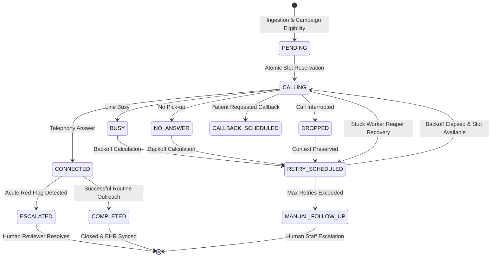

# Queue Design Document: Outbound Scheduling & Concurrency Governor

## 1. Architectural Philosophy & Objectives

In healthcare post-discharge outreach, queue management is a safety-critical discipline. Unlike generic FIFO worker queues:
1. Outbound calling capacity is strictly bounded (e.g. 5 or 10 concurrent lines per hospital tenant).
2. Patients have finite clinical follow-up windows (e.g. 48 hours post-discharge for CHF patients before readmission risk spikes).
3. Over-calling causes nuisance and compliance violations; under-calling causes missed clinical deteriorations.
4. Starvation of lower-acuity patients must be avoided while prioritizing urgent decompensations.

---

## 2. Queue State Machine

The outreach queue implements an explicit, traceable state machine:

---

## 3. Multi-Factor Prioritization Formula

To balance clinical acuity, impending deadlines, and anti-starvation, each task is scored dynamically:

$$PriorityScore = w_{risk} \cdot R(p) + w_{deadline} \cdot D(t) + w_{discharge} \cdot A_{dc}(t) + w_{camp} \cdot C_{lvl} + w_{starve} \cdot S(t) - P_{retry}$$

Where:
1. **Clinical Risk ($R(p)$)**: Normalized score (10 to 100) based on baseline acuity, discharge diagnosis, and comorbidity risk tier.
2. **Deadline Pressure ($D(t)$)**: Hyperbolic non-linear urgency ramp as remaining time to the clinical follow-up cutoff approaches zero:
   $$D(t) = \min\left(100.0, \frac{100.0}{1.0 + 0.5 \cdot \max(0.0, t_{remaining\_hours})}\right)$$
   *Justification*: A moderate-risk patient whose 48h follow-up window expires in 45 minutes receives a significant boost, enabling them to jump ahead of a critical-risk patient whose window just started and has 40 hours remaining.
3. **Discharge Age ($A_{dc}(t)$)**: Early outreach within the first 24 hours improves engagement.
4. **Campaign Weight ($C_{lvl}$)**: Hospital-assigned operational campaign priority (1 to 5).
5. **Anti-Starvation Aging ($S(t)$)**: Accumulates $+1.5$ points per hour spent in queue.
   *Justification*: Prevents low-acuity patients from starving perpetually behind streams of newer high-acuity admissions.
6. **Explicit Callback Guarantee**: If a patient requested an exact callback time, and the current time is at or past that timestamp, the task receives an immediate top priority override ($999.0 + \text{risk}$), guaranteeing next-slot dispatch.
7. **Calling Hours Suppression**: If current time in the hospital's timezone is outside permitted hours (e.g. before 9 AM or after 6 PM), priority is suppressed to $0.0$ unless specifically requested as a callback.

---

## 4. Concurrency Control & Slot Reservation

- **Problem**: In distributed environments with multiple asynchronous workers, workers competing for tasks can easily exceed hospital concurrency limits or double-dial the same patient.
- **Solution**: The `ConcurrencyGovernor` implements atomic database transactions.
  - Workers query hospital capacity and count tasks currently in `CALLING` or `CONNECTED` states.
  - The slot reservation executes in an isolated transaction that checks `active_calls < max_capacity` and transitions the candidate task to `CALLING` with `assigned_worker_id`, `call_started_at`, and `last_heartbeat_at`.
  - If capacity is saturated, the transaction rejects reservation without side effects.

---

## 5. Retry, Backoff & Dropped Call Recovery

- **Tiered Exponential Backoff**:
  - Attempt 1: 15 minutes backoff
  - Attempt 2: 60 minutes backoff
  - Attempt 3: 240 minutes backoff
- **Outcome Adjustments**:
  - `BUSY`: Halves the backoff interval (min 10 mins).
  - `DROPPED`: Retried promptly (10–15 mins) with conversation checkpoint preserved in `checkpoint_state_json`.
  - `DECLINED` / `INVALID_NUMBER`: No retry; immediately transitions to `MANUAL_FOLLOW_UP`.
- **Max Retries Exceeded**: When attempts reach `max_retries` (default 3), the task transitions to `MANUAL_FOLLOW_UP` and an alert is flagged on the operations dashboard.

---

## 6. Dead-Man Heartbeat Reaper (Worker Failure Recovery)

- Workers periodically update `last_heartbeat_at` on active tasks.
- If a worker crashes, the background `StuckWorkerReaper` detects tasks in `CALLING` state with heartbeats older than `WORKER_HEARTBEAT_TIMEOUT_SECONDS` (90s).
- The reaper automatically:
  1. Releases the held concurrency slot.
  2. Increments attempt count.
  3. Transitions task to `RETRY_SCHEDULED` or `MANUAL_FOLLOW_UP`.
  4. Records an immutable audit log entry.
